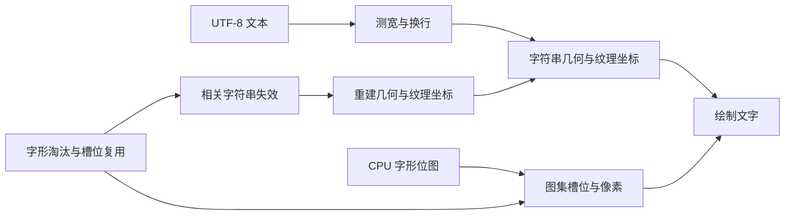
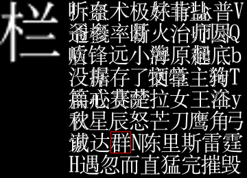
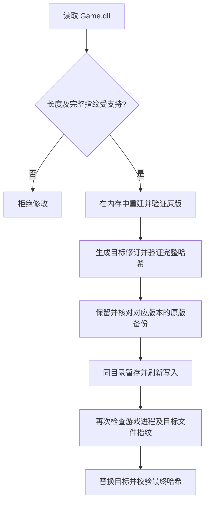

# 经典版 Warcraft III 高分辨率中文渲染故障分析与修复技术报告

日期：2026-09-06

对应实现：安装器 v2.1.0、补丁数据修订版 2

实现基线：[`ba4d8a3`](https://github.com/qinyihust/war3-cjk-font-fix/commit/ba4d8a340d48ca77bb50d4e2bb2e3c8227e0f2be)

## 摘要

经典版 Warcraft III 在高分辨率下可能出现中文技能、物品说明越界，以及长时间运行后的标签串字和笔画残留。调查发现，这些外观相近的现象涉及四处缺陷：字形缓存淘汰后的分配过早失败、UTF-8 换行游标提前推进、批量绘制遗漏失效字符串重建，以及纹理槽位复用时遗漏像素复制和清理。

高分辨率使实际栅格字号增大，更容易产生字形缓存压力；1920 × 1080 并非代码中的固定故障阈值。窗口模式切换触发缓存重建，可以解释暂时恢复的现象，但不会修正上述代码路径。

修复直接修改已确认构建的 `Game.dll`，保留原字体尺寸及缓存尺寸，补齐分配、排版和纹理重建的状态处理。v2.1.0 使用共享生成器适配八个精确构建，安装时仍以完整文件指纹选择补丁。八个构建通过真实引擎中的字形分配和换行诊断；独立、无插桩的 45 分钟长局证据目前仅覆盖 1.25b。

## 1. 调查范围与证据口径

本报告依据本项目的本地二进制分析、运行时取证、公开补丁字节和测试记录编写。函数名称为分析标签，不是 Blizzard 官方调试符号。第 3、4 节中的地址均为 **1.25.1.6397 的模块相对虚拟地址（RVA）**，不能直接用于其他版本。

| 层次 | 证据来源 | 可以支持的结论 |
|---|---|---|
| 控制流与数据结构 | [分析记录](ARCHITECTURE.md)、[引擎布局](../tools/engine-layouts.json)、[补丁定义](../patches/) | 编辑位置、分支方向、字段及调用约定的依据 |
| 字形分配与换行 | [八版本诊断数据](evidence/multiversion-r2.json) | 已记录样本中分配是否失败、消费字节数是否正确 |
| 嵌入机器码 | [NativePatchTests.cs](../tests/NativePatchTests.cs) | 替代引擎回调条件下的寄存器、栈、链表处理及写入边界 |
| 安装与恢复 | [CoreTests.cs](../tests/CoreTests.cs)、[LocalGameTests.cs](../tests/LocalGameTests.cs) | 文件识别、转换、恢复及备份行为 |
| 长局可见表现 | [长局摘要](evidence/long-session-r2.json)、[验证说明](VALIDATION.md) | 指定 1.25b 环境下定期抽查的表现 |

没有把短测通过解释为所有地图、字体、渲染后端或多人平台均兼容；也没有把插桩诊断当作独立长局验收。

## 2. 故障表现与字体渲染模型

### 2.1 为什么高分辨率更容易触发

已分析的字体缓存使用 8 张 256 × 256 的纹理图集。图集把多个字形的像素放在不同槽位中，绘制字符串时通过纹理坐标选择相应区域。字号增大后，一个汉字占用更多像素，固定尺寸图集能够容纳的不同字形减少。技能与物品说明包含较多不同汉字，反复查看这些说明会增加分配和淘汰次数。

粗略容量模型为“可用像素面积 / 单字形平均占用面积”；若字形宽高同比增大，占用面积近似按平方增长。该模型只解释压力趋势，实际容量还受字形宽度、排布及碎片影响，不能据此算出一个固定的显示分辨率上限。

### 2.2 必须保持一致的三类数据

字符串显示涉及三个不同层次：原始文本与换行边界、字形槽位与文字几何数据、图集像素。文本字节正确并不保证最终画面正确：旧纹理坐标可以取到另一个字，正确坐标也可能取到未清理的旧像素。



故障可按可见结果区分：

| 表现 | 本次确认的相关路径 |
|---|---|
| 提示文字超出边框、行宽不正确 | 字形分配失败导致测宽与绘制不一致；换行返回了多消费的字符 |
| 字符变成另一个字、常驻标签串字 | 字符串继续使用已经失效的纹理坐标；新槽位保留旧字像素 |
| 新旧笔画叠加 | 纹理复用时透明区域没有清理 |

这些缺陷可以共同出现，但不能仅凭一张乱码截图确定是哪一条路径出错。

## 3. 四项根因及修复算法

以下伪代码只表达修复涉及的状态转换，省略引擎原有的数据结构、锁定条件和错误处理，不能直接替代真实函数。

### 3.1 字形分配过早失败，使测宽与绘制失配

字形获取路径位于 RVA `0x7C5870`。缓存已满时，引擎淘汰一个旧字形并尝试插入新字形。如果新字需要更大的区域，一次淘汰仍可能不足；原路径此时直接返回失败。

测宽阶段遇到分配失败会漏算该字，稍后的绘制阶段再次请求字形却可能成功。两次调用使用了不同的有效字形集合，导致计算出的宽度小于最终显示宽度。这里的失败是缓存分配失败，不能等同于字体没有该字符。

修复在 RVA `0x7C5A49` 改变失败后的分支，使其继续沿引擎已有的淘汰路径重试：

```text
尝试插入字形
while 插入未成功:
    if 已无可淘汰字形:
        返回失败
    按引擎原有策略淘汰旧字形
    再次尝试插入
返回有效字形
```

终止条件仍由原有“无可淘汰项”路径控制。补丁没有在完全无法满足分配时无限重试，也没有扩大图集或改变字形尺寸。[对应实现](../tools/generate_profiles.py)中的编辑 ID 为 `glyph-allocation-retry`。

### 3.2 UTF-8 换行提前推进游标

模式 0 的换行路径位于 RVA `0x7C65C0`。原路径在判断新字符是否超宽之前推进输入游标，返回的前缀字节数因此可能包含本行不应接纳的字符。这一问题独立于缓存分配问题，ASCII 样本也能受影响。

普通字符需要满足以下顺序：

```text
读取候选字符，暂不提交输入游标
计算加入该字符后的行宽
if 超过可用宽度:
    结束本行，保持已接受前缀的边界
else:
    接受字符并提交输入游标
```

补丁通过五个 `utf8-*` 编辑位置调整推进时机，同时保留颜色控制码、显式换行和极窄行的进度规则，没有强制切换全局排版模式。极窄行必须能够消费输入，避免下一轮仍停留在同一字符；因此不能把普通字符的宽度判断机械套用到所有特殊路径。

历史样本中，可用宽度为 819 像素，原版返回前缀实际宽度为 840 像素，修复后为 810 像素。这是具体输入上的换行边界测量，不是整个界面的像素级对比。八版本诊断进一步核对返回字符数与消费字节数，详见第 6 节。

### 3.3 批量绘制遗漏字符串失效处理

第一版修复分配和换行后，约 20 分钟的长局仍出现“物品栏”串字。取证发现原始 UTF-8 内容正确，字符串对象 `+0x80` 的纹理失效标志已经设置，但批量绘制路径继续使用旧几何和纹理坐标。单字符串路径存在相应检查，批量路径遗漏了该处理。

第二版在 RVA `0x7C6333` 的批量渲染调用前插入 54 字节短代码：遍历批次中的字符串，对失效项调用引擎原有重建函数 `0x7C7110`，再进入原渲染函数 `0x7C5EB0`。

```text
for 当前批次中的每个字符串:
    if 字符串已失效:
        先清除本次失效标志
        调用引擎的字符串重建函数
继续原批量绘制
```

**清除标志必须发生在重建之前。** 重建也会申请字形，可能再次淘汰缓存并让字符串失效。如果在重建之后无条件清除标志，会抹掉这次新失效。当前顺序保留新标志，让后续绘制有机会再次处理；它不声称一次遍历就能消除所有后续缓存变化。

这部分实现保留批次链表结构及引擎自己的几何重建逻辑。空链表、无失效项、选择性重建及重建期间再次失效均由原生测试覆盖。

### 3.4 图集复用时遗漏复制，并残留旧像素

CPU 字形位图描述符的 `+0x24` 状态在已经上传后为 0。当 GPU 字形被淘汰并重新分配到新槽位时，纹理重建仍根据这个 CPU 状态跳过复制。此时“CPU 位图曾上传过”并不意味着“新目标槽位已有正确像素”。

实际取证中，“栏”的 CPU 源位图正确，但新目标槽位保留着“群”的像素：



上图是故障证据，不是修复成功截图。除了恢复复制，还需要处理透明区：如果只覆盖非透明笔画，新字周围仍可能留下旧字笔画。

修复对变脏的图集执行完整重建：

```text
if 图集需要更新:
    清零该图集的 256 × 256 × 4 字节像素缓冲区
    按当前槽位重新复制全部有效字形
    继续引擎原有的纹理更新路径
else:
    沿原快速路径运行
```

每次清零范围为 262,144 字节；这不意味着每帧清空八张图集。实现取消了“CPU 已上传”状态导致的错误跳过，并保留未变脏时的快速路径。原生测试检查完整清零范围以及前后各 16 字节保护区。[编辑定义](../patches/war3-1.25.1.6397.json)为 `atlas-clear-stub`、`atlas-clear-hook` 和 `atlas-copy-live-glyphs`。

## 4. 二进制补丁与多版本适配

### 4.1 实现组成

修订版 2 由字形分配分支修改、五处 UTF-8 控制流修改、批量重建短代码及调用点、图集清零短代码及调用点、有效字形复制条件修改组成。1.25b 的具体 RVA 和编辑 ID 可查阅[地址表](ARCHITECTURE.md#修改位置)。

机器码中的调用和跳转使用相对位移，基本关系为：

```text
rel32 = 目标 RVA - 下一条指令 RVA
```

新增代码不引入绝对地址重定位。分析和验证必须分别处理 RVA 与文件偏移，并确认整条被替换指令的边界、跳转目标及可执行映射；文件中存在零字节并不自动意味着那段空间适合运行代码。

### 4.2 两类编译器布局

共享算法不意味着八份 DLL 的地址和原指令相同。已核对的版本分为两类：

| 项目 | 1.20e / 1.21 | 1.22 / 1.23 / 1.24b / 1.24e / 1.25b / 1.26 |
|---|---|---|
| 编译布局 | 保留帧指针 | 另一类不保留帧指针的布局 |
| 图集调用点被覆盖的原指令 | `mov esi, [eax+0x1b0]` | `mov ecx, [eax+0x1b0]` |
| 新增清零实现 | 内联 `rep stosd`，明确清除方向标志 | 调用该构建现有的 `memset` |
| 清零短代码长度 | 28 字节 | 33 字节 |
| 批量重建短代码长度 | 54 字节 | 54 字节 |

生成代码分别恢复原指令应有的 ESI 或 ECX 输出。清零前保存寄存器与标志，随后恢复；内联清零不把改变后的方向标志带回调用方。测试直接验证通用寄存器、栈及进位标志；这不等于对每个处理器标志组合都做了穷举验证。

已核对的两类布局具有相同的相关字符串失效位、批次链表及图集结构。各构建的函数地址、原指令和归一化锚点仍分别记录，不能通过单一地址差值推断整个新版本。

### 4.3 新增代码的存放位置

| 版本 | 精确构建 | 代码位置 | 文件增长 |
|---|---|---|---:|
| 1.20e | 1.20.4.6074 | 已核对的 `.text` 尾部空间 | 0 |
| 1.21 | 1.21.0.6263 | 新增 `.cjk` 节 | 8,132 字节 |
| 1.22 | 1.22.0.6328 | `.text` 尾部空间 | 0 |
| 1.23 | 1.23.0.6352 | `.text` 尾部空间 | 0 |
| 1.24b | 1.24.1.6374 | `.text` 尾部空间 | 0 |
| 1.24e | 1.24.4.6387 | 新增 `.cjk` 节 | 4,096 字节 |
| 1.25b | 1.25.1.6397 | `.text` 尾部空间 | 0 |
| 1.26 | 1.26.0.6401 | `.text` 尾部空间 | 0 |

1.21 和 1.24e 的原代码节尾部分别只有 48 和 70 字节，无法容纳所需代码及布局。生成器在原文件全部内容之后追加 `.cjk`，保留原有尾部覆盖数据（overlay）；检查空闲的 40 字节节表项，更新节数、代码大小和映像大小。

新节虚拟内容为 128 字节，原始数据按 4 KiB 对齐，权限为只读可执行（`0x60000020`，实机映射为 `r-x`）。1.21 原文件末尾尚未页对齐，因此总增长包含额外对齐空间。使用 `.text` 尾部的构建则检查原始数据覆盖范围和最后一个实际映射页。

### 4.4 “通用”的具体含义

[`generate_profiles.py`](../tools/generate_profiles.py)结合[`engine-layouts.json`](../tools/engine-layouts.json)生成各构建的补丁定义。输入首先必须匹配原版完整长度和 SHA-256，再核对机器架构、映像基址、指令锚点和预期原始字节。

归一化锚点保留寄存器及结构偏移，屏蔽相对分支操作数和绝对映像地址中的构建差异。锚点用于维护阶段的复核，不是允许任意未知 DLL 通过的匹配规则。运行时安装器不执行模糊扫描，而是使用编译时嵌入的完整指纹白名单。

1.25b 修订版 2 的完整输出 SHA-256 在生成器中另有显式断言，确保多版本整理不会无意改变已经通过长局的补丁。完整输入及输出指纹集中维护在[兼容表](COMPATIBILITY.md)。

## 5. 安装与精确恢复



[`PatchEngine`](../src/War3FontFix/PatchEngine.cs)处理纯字节变换：识别已知修订后，先恢复精确原版，再生成目标修订。含新增节的配置使用 schema 2，记录修订对应的文件长度；追加区域在原始逻辑映像中必须为零，增长上限为 1 MiB。只有完整指纹匹配的已知补丁文件可以在恢复时截去新增内容，恢复后还要验证原版完整哈希。

[`PatchService`](../src/War3FontFix/PatchService.cs)负责游戏退出检查、每个版本独立的备份、暂存写入和替换前复核。已知当前补丁重复安装不修改文件；恢复后保留备份。已有备份若不匹配对应原版，会拒绝覆盖。完整已知补丁也能够在备份缺失时重建原版，未知或损坏的文件不能这样强制恢复。

同目录互斥锁用于约束同一 Windows 会话内的安装器实例，不能阻止任意外部进程写文件；替换前的目标复核用于发现已经发生的外部修改，不构成跨所有进程的事务锁。

版本转换器会替换游戏文件并覆盖字体补丁。因此操作顺序为：退出游戏、切换版本、重新检查并安装对应补丁。补丁本身不负责版本切换，也不修改地图、字体资源或显示分辨率。

## 6. 验证结果及其边界

### 6.1 八版本字形压力与换行诊断

八个构建均通过实际版本转换、安装和冷启动，在 3120 × 2080、Direct3D 8 环境下执行诊断。每轮使用字体字符映射确认存在字形的 1,800 个不同汉字，实际栅格字号为 32 像素，调用发生在游戏渲染线程。

| 版本 | 本轮诊断场景 | 原分配路径失败 | 修复轮 1 / 轮 2 失败 |
|---|---|---:|---|
| 1.20e | 局域网菜单 | 227 | 0 / 0 |
| 1.21 | Booty Bay 对战、攻击说明 | 294 | 0 / 0 |
| 1.22 | 局域网菜单 | 227 | 0 / 0 |
| 1.23 | 局域网菜单 | 227 | 0 / 0 |
| 1.24b | 局域网菜单 | 227 | 0 / 0 |
| 1.24e | IMBA 3.86b AI、洗礼学习说明 | 205 | 0 / 0 |
| 1.25b | 局域网菜单 | 227 | 0 / 0 |
| 1.26 | IMBA 3.86b AI、洗礼学习说明 | 228 | 0 / 0 |

测试顺序为“修复 → 原路径 → 修复”。A/B 只临时切换分配和 UTF-8 换行的六个编辑位置，批量重建和图集修复保持启用，故表中的“原路径”**不是完整未修补 DLL 的独立基线**。同一进程的缓存状态随测试变化，失败次数不能直接作为版本间性能排名。

换行测试由 2 种模式 × 2 种路径状态 × 6 类输入组成，每个构建共 24 个样本。六类输入为中文、ASCII、颜色控制码、显式换行、极窄行和空字符串。修复后的关键检查为：

- 测试所用汉字均以 3 字节 UTF-8 编码，消费字节数等于接受字符数的三倍；这一关系不适用于所有 Unicode 字符。
- ASCII 消费字节数与接受字符数一致；含颜色前缀的样本额外计入前缀 10 字节。
- 显式换行消费到对应边界，极窄非空行仍推进输入，空串返回零。
- 所有样本均未消费超过输入总长度。

八个构建的新增代码入口映射均为 `r-x`。真实游戏内批量渲染路径的入口计数覆盖 1.21、1.24e、1.26；其余菜单场景该入口计数为零，不能宣称已经完成同等游戏内验证。全部八份机器码另有独立原生测试，但替代回调不能等价于完整渲染器。

1.21 创建 IMBA 时被游戏提示“该地图太大了”，因此改用基础地图。字体适配不解除旧版本的地图大小或脚本限制。原始计数、全部换行样本及截图链接见[验证记录](VALIDATION.md)和[诊断数据](evidence/multiversion-r2.json)。

### 6.2 无插桩长局

1.25b 修订版 2 在同一冷启动进程中连续运行 2,748.545 秒，即 45 分 48 秒；环境为 3120 × 2080、Direct3D 8、IMBA 3.86b AI 和 9 名中等 AI。验收期间没有附加调试器、运行时修补或窗口模式切换。

定期抽查覆盖技能学习、已学技能、商店和背包物品、帮助页、联盟界面及常驻标签。全能骑士经历死亡和复活，升至 4 级，洗礼从 1 级升至 2 级。抽查文字正常，未出现新游戏错误记录，最后从菜单正常退出。


该验收按时长结束，并未以完成整场对局为条件；部分时间英雄在泉水停留，画面只做定期抽查。私有内存从约 394.68 MiB 增至 509.86 MiB，没有相同负载的原版长局对照，因此不能认定该增长由补丁导致，也不能宣称没有内存泄漏。详细资源采样见[相对时间记录](evidence/soak-r2-samples.jsonl)。

### 6.3 自动验证与可复核性

已完成的验证包括 16 组合成测试及配置目录校验、全部八份原生 x86 短代码测试、八份本地真实 DLL 的临时副本安装和恢复测试，以及生成器和 PE/指令检查。文件测试覆盖重复安装、旧版升级、未知文件拒绝、损坏备份、缺失备份恢复、目标占用、外部修改和新增节恢复截断等情况。

在源码仓库中可以执行：

```powershell
.\scripts\build.ps1
.\scripts\test.ps1

# 可选：只读使用自己持有的受支持 DLL，文件操作在临时副本上进行
.\scripts\test.ps1 -GameDll "C:\Games\Warcraft III\Game.dll"

# 可选：维护者需安装 tools/requirements.txt 中的依赖
python tools/generate_profiles.py "C:\Private\War3Originals" --check
python tools/verify_patch.py "C:\Games\Warcraft III\Game.dll"
```

生成器要求各原版位于 `<原版目录>/<四段版本号>/Game.dll`；PE 检查器要求输入已修补的当前修订。默认构建和测试无需游戏文件。运行时插桩的诊断调用步骤在本文说明，公开数值可供复核；发布安装器不会自动执行这些诊断，也不携带私有游戏文件或内存转储。完整依赖和操作条件见[构建说明](BUILDING.md)。

## 7. 方案取舍与后续工作

窗口切换引起字体尺寸和缓存重建，与暂时恢复的观察一致。这一解释不能证明每个出现相似乱码的环境都具有同样根因。单纯增加缓存容量可以推迟淘汰，却没有修正已经确认的游标推进、失效处理或纹理复用逻辑。本实现选择保持原图集尺寸和 32 像素栅格化上限，修正状态转换本身。

代价主要发生在缓存需要重建时：脏图集清零并完整填充增加工作量，批量绘制前增加字符串检查，必要时调用几何重建。目前没有原版与补丁的同负载帧率基准，不能声称性能损耗为零。

后续验证应优先覆盖：其他七个构建的独立长局、更多地图与实际字体组合、同负载帧时间和内存对照，以及其他渲染后端和多人平台。新增构建仍需独立核对指令、结构和终止条件；仅替换版本号、哈希或套用偏移不构成有效适配。

## 8. 实现与证据索引

| 内容 | 仓库入口 |
|---|---|
| 简要根因、1.25b 地址表 | [ARCHITECTURE.md](ARCHITECTURE.md) |
| 完整构建指纹及恢复范围 | [COMPATIBILITY.md](COMPATIBILITY.md) |
| 测试场景、资源观察和历史失败 | [VALIDATION.md](VALIDATION.md) |
| 共用生成器与版本布局 | [generate_profiles.py](../tools/generate_profiles.py)、[engine-layouts.json](../tools/engine-layouts.json) |
| 字节变换和配置校验 | [PatchEngine.cs](../src/War3FontFix/PatchEngine.cs)、[PatchProfile.cs](../src/War3FontFix/PatchProfile.cs) |
| 磁盘安装与备份 | [PatchService.cs](../src/War3FontFix/PatchService.cs) |
| 原生代码及文件验证 | [tests](../tests/)、[verify_patch.py](../tools/verify_patch.py) |
| 新增构建的要求 | [PORTING.md](PORTING.md) |
| 外部参考与第三方权利说明 | [NOTICE.md](../NOTICE.md) |
