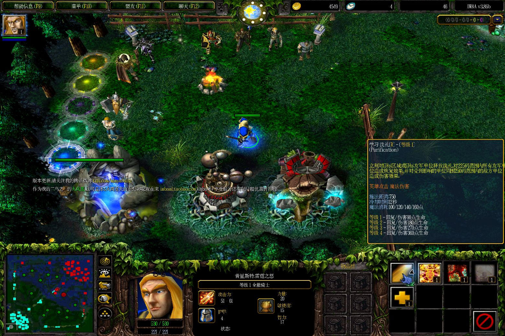

# 验证记录与适用范围

本页把游戏补丁的数据修订与公开安装器的代码整理分开记录。公开安装器 2.0.0 生成的 DLL 与下列已验收修订版 2 指纹相同；本次代码整理没有再跑一轮长局。

## 修订版 2：实际游戏长局

| 项目 | 记录 |
|---|---|
| 日期 | 2026-09-06 |
| 游戏 | 完整指纹限定的 1.25.1.6397 |
| 分辨率 / 渲染器 | 3120 × 2080 / Direct3D 8 |
| 地图 | IMBA 3.86b AI，默认模式，9 名中等 AI |
| 连续实测时间 | 2,748.545 秒，即 45 分 48 秒 |
| 运行条件 | 冷启动同一进程；无调试器附加、无运行时内存修补、无窗口模式切换 |
| 覆盖 | 技能学习及已学技能说明、商店/背包物品、帮助页滚动、联盟界面、常驻标签 |
| 英雄变化 | 全能骑士，3 次死亡/复活，升至 4 级，洗礼从 1 级升至 2 级 |
| 结果 | 抽查文字正常，无新游戏错误记录，最终从菜单正常退出 |

9 名 AI 持续作战，人工操作以查看提示和界面切换为主，穿插英雄移动与战斗。部分时段英雄在泉水停留，出现过地图挂机提示。按验收时长结束，没有以推倒主基地为完成条件。截图是定期检查，不是逐帧录制。

上图为真实经过 45 分钟后的洗礼二级说明。早期原版故障截图如下；角色等级与采样时刻不同，不作为同一帧的像素级对照。

## 资源观察

验收区间内有 91 条约每 30 秒一次的数值采样。工作集 296.02–454.47 MiB，起止 394.93 → 314.55 MiB；私有内存 394.68 → 509.86 MiB，增长约 115.18 MiB。句柄 5,155–5,257，线程 59–63。

私有内存增长如实保留，没有同负载原版长局基线，因此不能归因于补丁，也不能宣称无泄漏。`Responding=true` 只作辅助信息，不单独证明无卡死。尚未完成帧率基准、内存泄漏验收或其他渲染后端对照。

公开数值记录为 [summary.json](evidence/long-session-r2.json) 和 [relative-time samples](evidence/soak-r2-samples.jsonl)。采样保留相对经过时间与资源数值，移除了本机进程号和绝对时间。

## 早期失败及修正依据

修订版 1 的短测修正了字形分配和换行，但长局约 20 分钟后仍出现“物品栏”串字。修订版 2 补齐批量失效处理及脏纹理像素重建。详见 [技术分析](ARCHITECTURE.md)。

历史字形压力测试使用字体字符映射确认存在字形的 1,800 个汉字：

| 字体栅格字号 | 原版分配失败 | 修订版 1 分配失败 |
|---|---:|---:|
| 16 像素 | 0 | 0 |
| 24 像素 | 124 | 0 |
| 32 像素 | 185 | 0 |

这是字号对照，不是三个显示分辨率的整局测试。该历史数据只能支持修订版 1 的分配修正；修订版 2 保留同样字节，但不能用这张表替代新增渲染路径的长局证据。

开发阶段的实验插桩曾造成崩溃，包括一处原型返回地址落在指令中间。最终代码已修正并验证指令边界；这些调试崩溃与后续独立冷启动长局分开，不归因于原始游戏故障。

## 公开安装器重构验证

- 合成文件测试：往返恢复、旧版升级、完整指纹拒绝、编辑位置/最终哈希校验、备份保留和损坏拒绝、缺失备份恢复。
- 文件操作测试：已占用目标、外部修改、并发安装及游戏退出检查。
- 原生 x86 测试：内嵌短代码的空链表/选择性重建、再次失效、寄存器/栈/进位标志、完整纹理清零和保护区。
- 可选本地文件测试：用实际支持的 DLL 在临时副本上安装、升级、回滚；原输入文件保持不变。
- CLI：只读状态检查、标准输出和退出码；发布包哈希校验。
- 本机桌面 GUI 复核：中文启动界面、游戏目录输入、只读检查和状态输出布局正常；正确识别当前修订版 2。未遍历所有 DPI、多屏和语言组合。

测试依赖与复现命令见 [BUILDING](BUILDING.md)。原生测试替代引擎依赖，并不执行完整真实渲染器；自动测试通过与实际游戏场景的结论各有范围。
